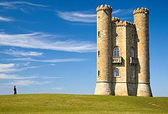
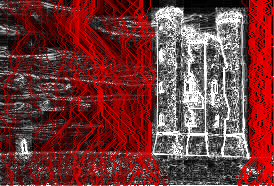
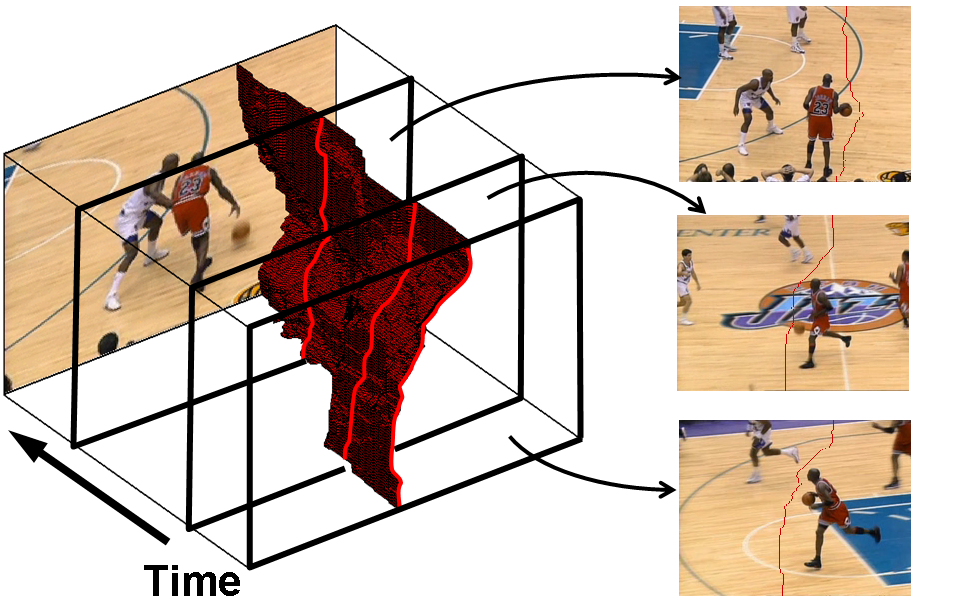
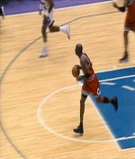
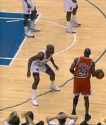
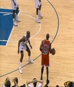

# Team 24: DIP Project Proposal
**TA:** Soumyasis Gun\
**Team Name:** Sned Noodles\
**Project 19:** Improved Seam Carving for Video Retargeting\
**GitHub-Repository:** [Link](https://github.com/Digital-Image-Processing-IIITH/project-sned-noodles)

## Team-Members

2018101033 – Jay Sharma\
2018101003 – Dhruv Arya\
2018101039 – Aakash Dantre\
2019121011 – Varun Chhangani\
2018101072  – Vishal Verma

## Main Goal

Content-aware video resizing, to match a different aspect ratio (accounting for different screen sizes), using seam-carving in 3D space-time volume, using graph cuts and dynamic programming.

## Problem Definition

Changing the aspect ratio of an image such that the result looks photorealistic and useful image features are preserved is not a trivial task. Directly resizing and scaling would stretch/squeeze the image, and cropping would lead to loss of useful information. Seam-carving is a method by which this problem is tackled. It removes “seams” from the image, such that the resulting image preserves useful information, still looking photorealistic.

   
  <em>Example Photo</em>

For example, if the above image is to be narrowed, the 3 techniques provide the following results.
|Cropped|Scaled|Seam-carved|
|---|---|---|
||||
|Part of castle is removed|Castle is distorted|Desirable output|

   
  <em>The removed seams</em>

This project is concerned with applying seam-carving for videos. This problem can be directly broken solved by seam-carving each frame of the video, but that introduces inconsistency between the frames (because of independent processing of the frames) and the resulting video looks jittery.

To avoid this, the seams are to be removed such that the removed seam of one frame corresponds to a respective seam removed in next frame, and so on. To put this another way, a 2D manifold has to be removed from the 3D space-time volume (i.e. stack of multiple 2D frames over a time interval).

   
  <em>2D Seam Manifold</em>

The seam to be removed is the one with the lowest energy. The energy function can be calculated either of various methods like gradient map, saliency map, and entropy map.

## Expected Result

From a video of any aspect ratio, a video of a different aspect ratio has to be generated, such that the video is targetted to “useful” information (such as foreground objects in focus), and achieves photorealism and minimal jitter. We will also be comparing the results of the given paper with our implementation with different energy functions employing methods like entropy, saliency, gradient, histogram of gradients direction and eye movement measurements.
|Seam-carved|Scaled|Seam-carved|Scaled|
|---|---|---|---|
|||||

## Project Milestones and Timeline

|Milestone|Date Of Completion|
|---|---|
|Look into seam-carving algorithm for images|21 Oct|
|Calculating forward energy using dynamic programming|26 Oct|
|Implementing graph cuts for forward energy|31 Oct|
|Implementing 3D seam carving using forward energy|5 Nov|
|Comparing various methods of calculating energy functions|12 Nov|
|Testing results on videos|17 Nov|

## Dataset Requirement

There is no requirement for a specifically curated dataset. Videos on YouTube with potential of  background removal using seam-carving to fit on a different aspect ratio can be downloaded and used directly.
